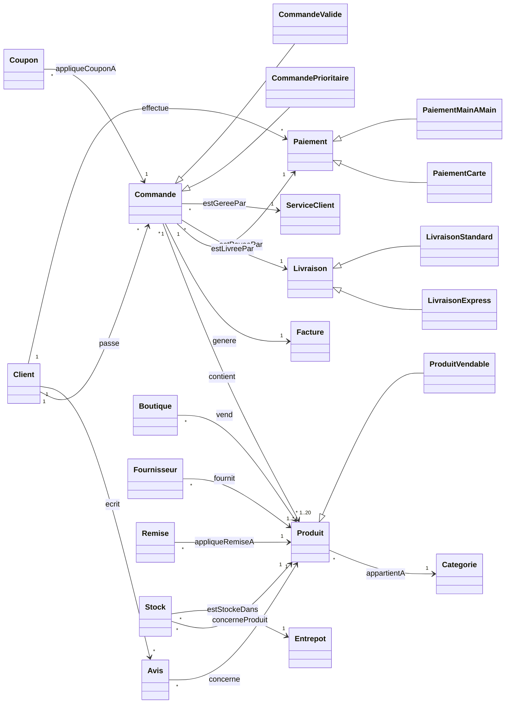

# Ontologie e-commerce : OWL 2, SWRL, SHACL

[](https://github.com/thiilelli/Onto/actions/workflows/ci.yml)
[](LICENSE)

Ontologie OWL 2 du commerce électronique (clients, commandes, produits, stocks, paiements, livraisons) accompagnée d'une chaîne complète de traitement : raisonnement automatique avec règles SWRL, validation des données en SHACL, interrogation SPARQL et tests d'intégration continue.

## Modèle

| | |
|---|---|
| Classes | 22 (dont 3 inférées par règles) |
| Propriétés d'objet | 32 (16 paires inverses) |
| Propriétés de données | 36 |
| Règles SWRL | 3 |
| Individus de test | 41 |
| Formes SHACL | 9 |



Les identifiants sont en ASCII ; chaque classe et propriété porte des libellés en français et en anglais (`rdfs:label`).

## Règles d'inférence

| Règle | SWRL | Résultat sur les données |
|---|---|---|
| R1 : commande prioritaire | `Commande(?c) ∧ estLivreePar(?c, ?l) ∧ LivraisonExpress(?l) → CommandePrioritaire(?c)` | O01 |
| R2 : produit vendable | `Produit(?p) ∧ vend(?b, ?p) ∧ Boutique(?b) ∧ concerneProduit(?s, ?p) ∧ quantite(?s, ?q) ∧ swrlb:greaterThan(?q, 0) → ProduitVendable(?p)` | P01, P02, P03, P05 (P04 est en rupture) |
| R3 : commande valide | `Commande(?c) ∧ contient(?c, ?p) ∧ genere(?c, ?f) ∧ estPayeePar(?c, ?pay) → CommandeValide(?c)` | O01, O02 |

## Monde ouvert, monde fermé : pourquoi OWL *et* SHACL

OWL raisonne sous l'**hypothèse du monde ouvert** : si une commande n'a pas de facture dans le graphe, le raisonneur conclut que la facture existe mais est inconnue, pas qu'il y a une erreur. Une restriction « exactement 1 facture » sert donc à **déduire**, pas à **contrôler**.

Deux conséquences ont guidé la conception :

1. **Sans hypothèse du nom unique**, deux valeurs pour une propriété limitée à 1 ne déclenchent pas d'erreur : le raisonneur en déduit que les deux individus sont le même. Par exemple, un stock associé à deux produits ferait conclure que ces produits sont identiques. L'ontologie déclare donc les individus distincts (`owl:AllDifferent`) pour transformer ces cas en incohérences détectables.
2. **Pour valider des données**, il faut le monde fermé. Les formes SHACL vérifient ce qu'OWL ne peut pas vérifier : champs obligatoires, notes entre 1 et 5, format des emails, paiement postérieur à la commande, somme des stocks inférieure à la capacité de l'entrepôt.

Les tests matérialisent cette distinction : une facture manquante est acceptée par Pellet mais rejetée par SHACL, alors qu'un individu à la fois `Client` et `Produit` rend l'ontologie incohérente.

## Démarrage rapide

### Explorer dans Protégé

Ouvrir `ontology/ecommerce.ttl` dans [Protégé](https://protege.stanford.edu/) (5.6+), lancer le raisonneur **Pellet** (les règles utilisent le built-in `swrlb:greaterThan`, non pris en charge par HermiT), puis consulter les instances inférées de `CommandePrioritaire`, `ProduitVendable` et `CommandeValide`.

### En ligne de commande

Prérequis : Python 3.10–3.12 et Java 11+ (utilisé par Pellet).

```bash
git clone https://github.com/thiilelli/Onto.git
cd Onto
python -m venv .venv && source .venv/bin/activate
pip install -r requirements.txt

python scripts/reason.py     # cohérence + inférences, écrit build/ecommerce-inferred.ttl
python scripts/validate.py   # validation SHACL
python scripts/query.py      # requêtes SPARQL sur le graphe inféré
pytest                       # 17 tests
```

## Résultats

```text
$ python scripts/reason.py
✓ Ontologie cohérente (Pellet)

CommandePrioritaire  O01
ProduitVendable      P01, P02, P03, P05
CommandeValide       O01, O02
```

```text
$ python scripts/query.py queries/05-occupation-entrepots.rq
adresse                    capacite  stocke  occupationPct
-------------------------  --------  ------  -------------
Constantine, Ali Mendjeli  50        30      60
Alger, Oued Smar           70        32      46
Oran, Es Senia             20        8       40
```

| Requête | Question |
|---|---|
| `01-produits-vendables.rq` | Quels produits la règle R2 classe-t-elle vendables ? |
| `02-statut-commandes.rq` | Statut de chaque commande et classes inférées |
| `03-total-commandes.rq` | Montant brut et net (remises déduites) par commande |
| `04-note-moyenne-boutiques.rq` | Note moyenne des avis par boutique |
| `05-occupation-entrepots.rq` | Taux d'occupation des entrepôts |

## Structure du dépôt

```text
ontology/ecommerce.ttl          ontologie OWL 2 + règles SWRL + individus
shapes/ecommerce-shapes.ttl     contraintes SHACL
queries/*.rq                    requêtes SPARQL
scripts/reason.py               raisonnement Pellet (owlready2)
scripts/validate.py             validation SHACL (pySHACL)
scripts/query.py                exécution des requêtes (rdflib)
tests/                          tests pytest (raisonnement et validation)
.github/workflows/ci.yml        intégration continue
```

